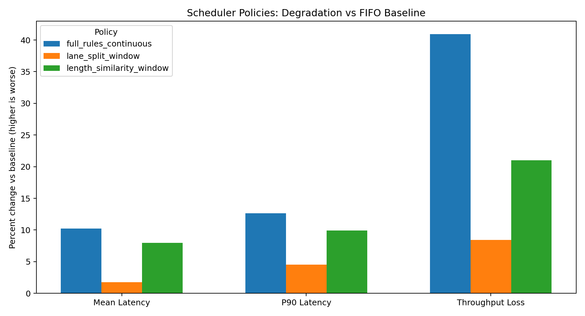
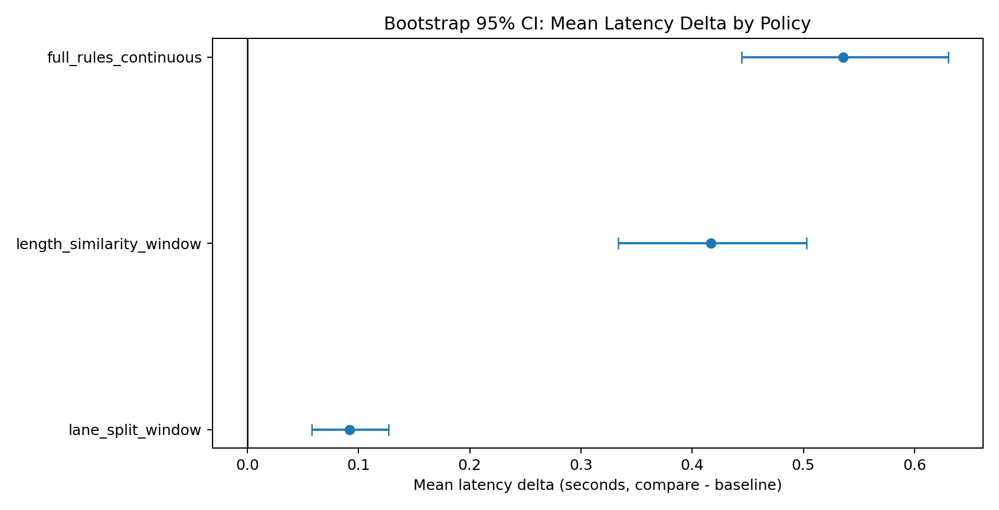

# Scheduler Rules Benchmark
## Setup, Analysis, and Recommendation

- Objective: test whether scheduling rules improve speculative-decoding serving quality.
- Baseline policy: `fifo_mixed_window`.
- Candidate policies:
  1. `lane_split_window`
  2. `length_similarity_window`
  3. `full_rules_continuous`

---

# Why This Benchmark

- GPU micro-optimizations were unstable across environments.
- Next lever: request scheduling under mixed request lengths.
- Rules under test:
  1. split short/long lanes
  2. avoid mixing tiny and long in one batch window
  3. batch by similar remaining decode length
  4. continuous batching with max wait bound

---

# Experiment Setup

- Notebook: `debug_scheduler_rules_benchmark.ipynb`
- Service profile source: `results/gpu_scheduler_service_profile.csv`
- Request traffic simulation:
  1. Arrival rates: 0.20, 0.35, 0.50 req/s
  2. Requests per trial: 300
  3. Trials per rate: 25
  4. Total policy comparisons: 75 paired trials per policy
- Metrics:
  1. mean latency
  2. p90 latency
  3. mean wait
  4. p90 wait
  5. throughput

---

# Policies Compared

| Policy | Key idea |
|---|---|
| `fifo_mixed_window` | Baseline FIFO + batching window |
| `lane_split_window` | Separate short/long lanes |
| `length_similarity_window` | Similar remaining lengths in a batch |
| `full_rules_continuous` | Lanes + similarity + continuous batching |

---

# Mean Results vs Baseline

- All tested policies are worse than baseline in this run.
- `lane_split_window` is the least bad.
- `full_rules_continuous` is the most degraded.

---

# Statistical Confidence (Bootstrap)

- Source: `results/gpu_scheduler_policy_bootstrap_ci.csv`
- For mean-latency delta, all policy CIs are strictly above zero.
- Interpretation: degradation is statistically consistent, not noise.

---

# Delta Table (Mean vs Baseline)

| Policy | Mean Latency | P90 Latency | Mean Wait | P90 Wait | Throughput |
|---|---:|---:|---:|---:|---:|
| `lane_split_window` | +1.76% | +4.55% | +42.60% | +33.77% | -8.42% |
| `length_similarity_window` | +7.96% | +9.90% | +69.12% | +53.88% | -21.02% |
| `full_rules_continuous` | +10.24% | +12.65% | +80.83% | +61.62% | -40.91% |

Source: `results/gpu_scheduler_policy_delta.csv`

---

# Rate-wise Behavior

- At low load (0.20 req/s):
  1. lane split is near parity on mean latency but still worse on tail latency.
  2. full continuous still increases wait and tail latency.
- At medium/high load (0.35, 0.50 req/s):
  1. all policy variants degrade more strongly.
  2. full continuous has the steepest regression.

---

# Data Quality Caveat

- Throughput field contains invalid negatives in simulation output.
- Example issue observed: negative `throughput_rps` rows.
- Action:
  1. fix throughput formula in simulation post-processing.
  2. prioritize latency/wait conclusions until throughput is corrected.

---

# Recommendation

- Do **not** switch production scheduler to these rules yet.
- Keep baseline `fifo_mixed_window` as the default.
- If further tuning is required, only continue with `lane_split_window` first.

---

# Next Iteration Plan

1. Fix throughput calculation bug and rerun all policies.
2. Retune only lane-split knobs:
   - smaller batch window
   - stricter max-wait bound
   - weaker similarity constraint (or none)
3. Re-evaluate with:
   - mean and p90 latency
   - queue wait metrics
   - corrected throughput
4. Promote only if lane-split beats baseline across all three arrival rates.
