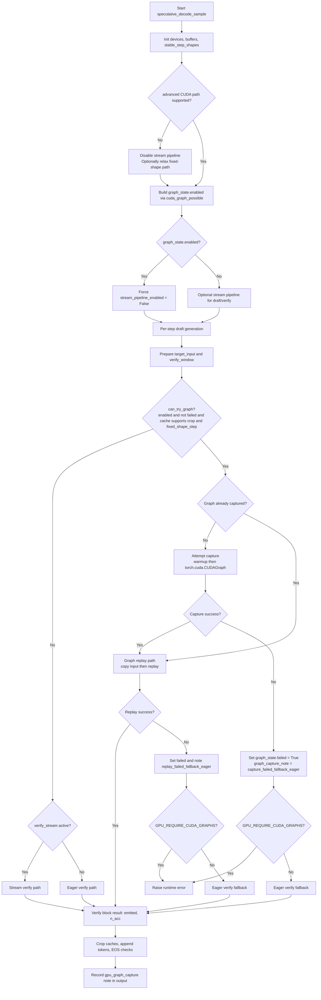

# Speculative Decoding Flow: CUDA Graph vs Non-Graph

This flowchart is aligned to the control flow around _cuda_graph_possible and verify execution in src/speculative.py.

For CLI export, use the raw Mermaid source file:
- docs/specdec_cuda_graph_flow.mmd

Example export command:

```bash
npx -y @mermaid-js/mermaid-cli -i docs/specdec_cuda_graph_flow.mmd -o figures/specdec_cuda_graph_flow.png -b transparent
```


