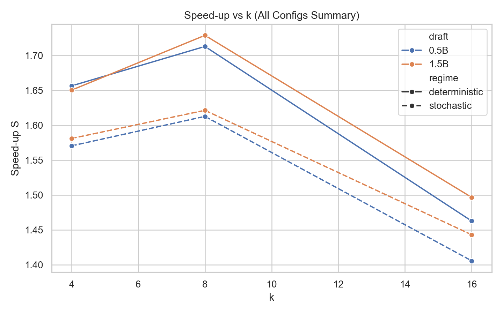
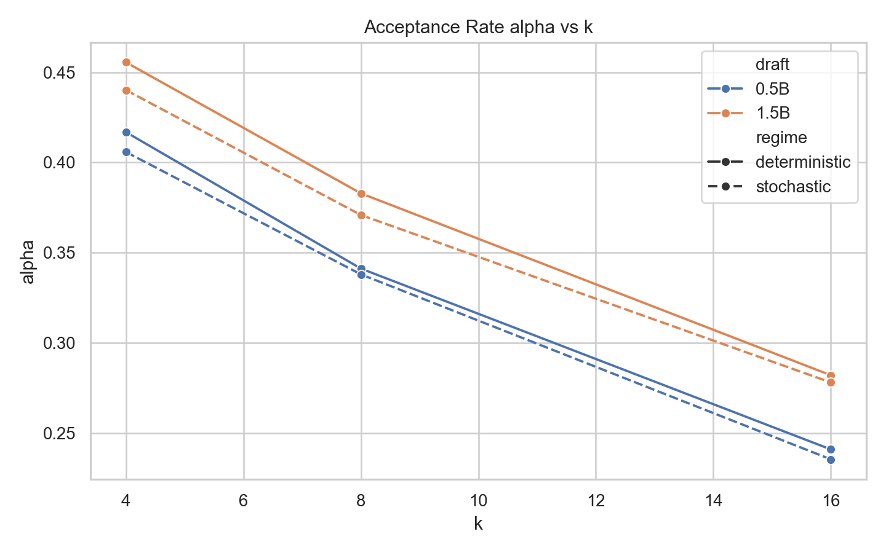
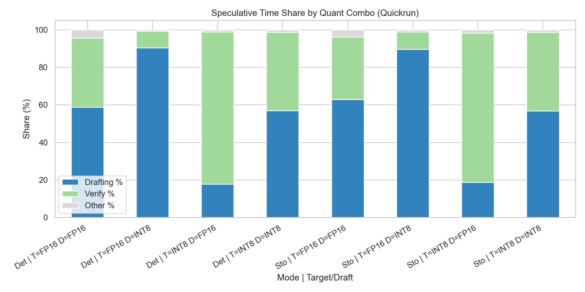
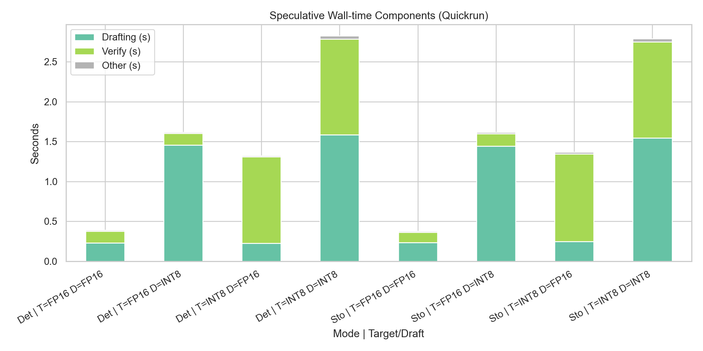
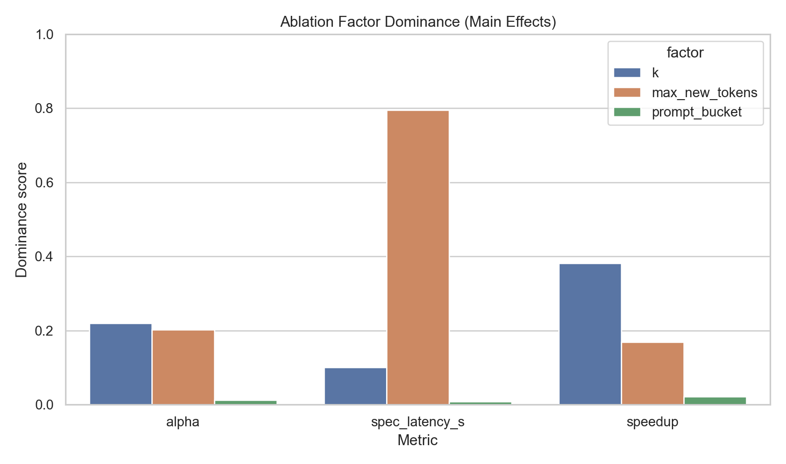
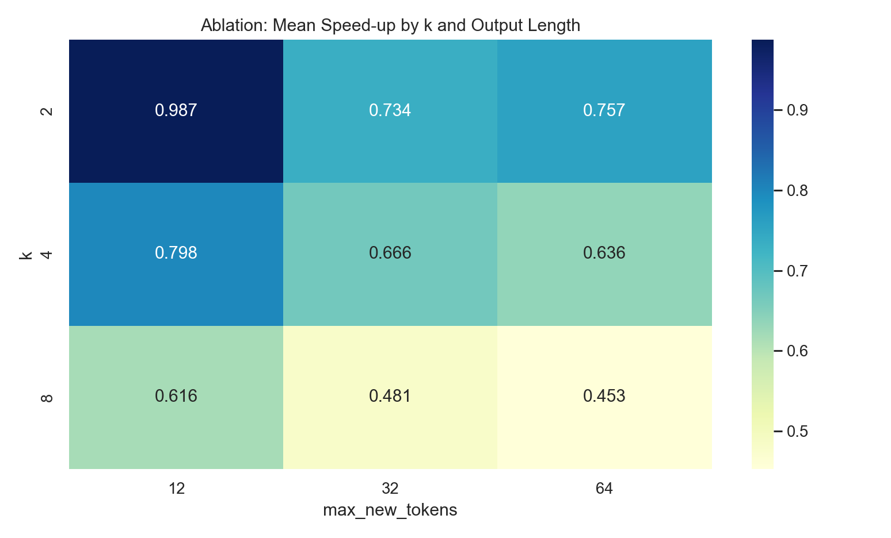
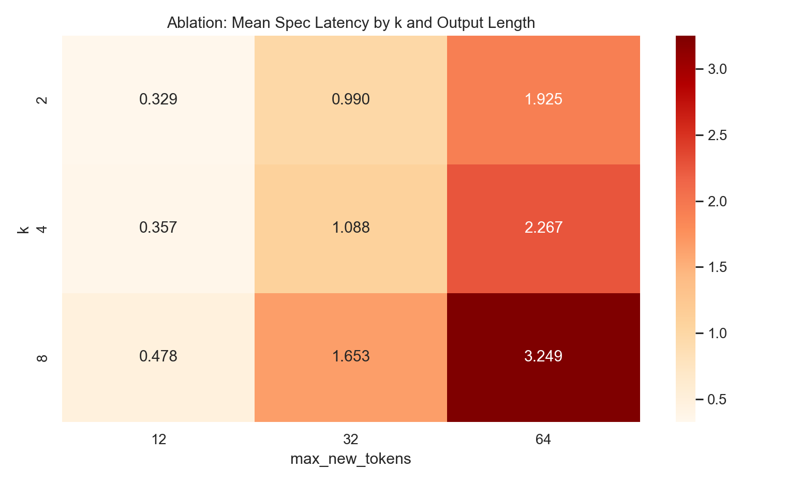
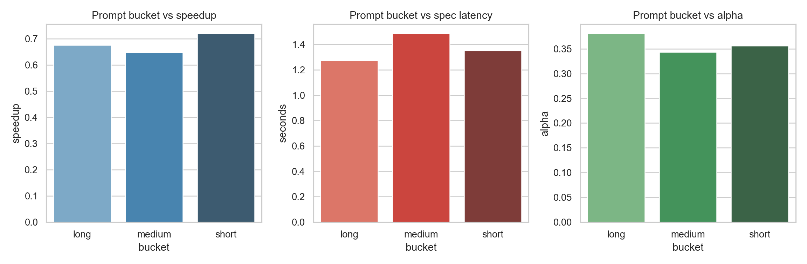

# Speculative Decoding
## Visual diagnosis of wall time and speed-up limits

- Data source: `results/all_configs_summary.csv`, `results/pivot_time_breakdown_debug_quickrun.csv`, and compact ablation outputs
- Focus: `alpha`, `B_eff`, `k`, and stage-wise bottlenecks

---

# What We Observe First

- Speed-up improves from `k=4` to `k=8`, then degrades at `k=16`.
- Higher proposal size does not always convert to higher net throughput.

---

# Acceptance Dynamics

- `alpha` declines as `k` increases.
- Larger blocks create more opportunities for mismatch and rejection.

---

# Where Time Is Spent (Share)

- `FP16 target + INT8 draft`: drafting dominates.
- `INT8 target + FP16 draft`: verify dominates.
- `FP16 + FP16` is balanced but still not automatically fastest.

---

# Where Time Is Spent (Seconds)

- Wall time is the sum of drafting, verify, and residual overhead.
- Speed-up is limited by the largest component, not by precision alone.

---

# Metric Lens

$$
\alpha = \frac{\text{accepted}}{\text{proposed}}, \qquad
B_{\text{eff}} = \frac{\text{accepted}}{\text{verify steps}}
$$

$$
S = \frac{T_{\text{baseline}}}{T_{\text{spec}}}, \qquad
T_{\text{spec}} \approx T_{\text{draft}} + T_{\text{verify}} + T_{\text{other}}
$$

- Even good `alpha` can underperform if draft/verify cost is imbalanced.

---

# Why FP16 + FP16 Can Still Underperform

- Moderate acceptance still causes correction overhead.
- Draft path and verify path can remain serialized on one GPU.
- Fixed costs (prefill, synchronization, kernel launch) dominate short outputs.
- `k` above optimum increases wasted draft work.

---

# Practical Implication

- Optimize the system, not a single precision knob.
- Priorities:
  1. Find the local-optimal `k`.
  2. Minimize dominant stage (draft or verify).
  3. Benchmark on longer decode lengths to reduce fixed-cost distortion.
  4. Track per-stage shares together with `alpha` and `B_eff`.

---

# Compact Ablation: What Dominates?

- `speedup`: most affected by `k` (dominance ~0.381).
- `spec_latency_s`: dominated by output length (dominance ~0.796).
- `prompt_bucket`: very small effect in this setup (all metrics near zero dominance).

---

# Ablation Heatmap: Speed-up

- Best region appears at lower `k` with shorter outputs.
- Increasing `k` consistently lowers speed-up in this compact FP16 run.

---

# Ablation Heatmap: Spec Latency

- Output length drives wall time much more than `k`.
- At large outputs, latency grows strongly across all `k`.

---

# Prompt Length Effect (Short vs Medium vs Long)

- Prompt bucket impact is secondary compared with `k` and output length.
- In this dataset, bucket changes are visible but not dominant.

---

# Updated Takeaway (with Ablation)

- For FP16 target + FP16 draft, low speed-up is not mainly a precision issue.
- Dominant factors from this ablation:
  1. `k` controls speed-up behavior.
  2. output length controls wall time.
  3. prompt length has minor contribution (in this compact setup).
- Practical choice: keep `k` moderate and benchmark at representative output lengths.
